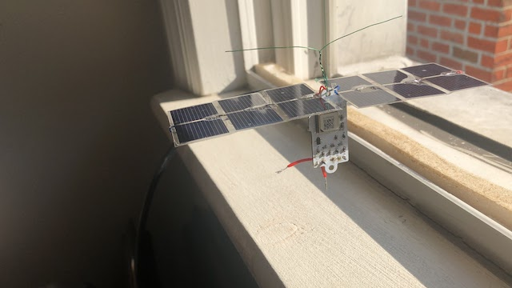

# K1FM Pico Balloon

## Introduction:

This tracker board is WSPR based and transmits on 20 meters. Version 1.3 weights 2.84 grams and takes around 55mA at 3.3V. Unlike other designs, this one includes a passband filter that significantly smooths the resulting waveforms (such filter would be legally mandatory in the United States). The board includes a power regulator and a low voltage dropout diode that can be useful if using batteries.

A maiden flight, powered by 6 29x19mm Aoshike solar panels, was attempted in New Jersey at the end of September 2019. After 5 days of transmissios the payload failed somewhere over Belize (central America) probably due to mechanical failure of the panels array.

Active development of this board can be followed in the [Aries HAB mailing list](https://ovmrc.groups.io/g/AriesHAB).

The recommended software is [GeminiWSPR](https://github.com/adecarolis/GeminiWspr)

Feel free to test these boards. You can purchase the latest revision (1.3) at OSHPark:

https://oshpark.com/shared_projects/ud3vH8MF

Suggestions and technical advice are welcome!

73 de Alain K1FM

## Assembly:

This is the recommended assemply sequence. Test each step individually. Do not proceed furter in case you enconter a problem in the current step.

- Install U1, C2, C3, C12, J2, Y1, R1, R2, R5 (Microcontroller)
- Use a USBasp programmer to load the Arduino bootloader (Atmel328p, 8MHz) via the ICSP port. Verify the bootloader can be uploaded without errors.
- Disconnect the USBasp from the J2 port. Connect a serial Arduino programmer to J3 (use 3V and GND connections from J2). Load the GeminiWSPR firmware (don't forget to set your own callsign and gridsquare!). Verify debug output can be seen on the serial monitor.
- Install GPS1, R6, Q2, C10 (GPS)
- Connect the GPS antenna
- In the Arduino serial monitor, verify the GPS is working
- Install Q1, U2, C11, C13, C14, R3, R4, R8, Q3 (Transmitter)
- Install L1, L2, L3, C5, C6, C7, C8, C9 (Bandpass filter)
- Connect the HF antenna 
- Verify the unit transmits WSPR on 14.0956 MHz
- Install U3, C1, C4, D1 (Power Supply)
Note: this is not needed if your power source is externally regulated or never exceeds 3.5 Volts
- Disconnect all J3/J2 connections. Verify the unit can be normally powered via J4

## Changelog:

**Version 1.0**
Initial, not functioning prototype.

**Version 1.1**
- Bugfixes

**Version 1.2**
- Added optional K1FM Pico Power board for battery charge management
- Added bottom hook for dipole antennas
- Replaced Si5351a quartz with TCXO (Q1)
- Added switches to power the Si5351a, GPS down (Q2 - Q3)
- Added temperature sensor (TMP-36)
- Added fixed V_BCK connection to 3.3V
- Added VDD measurement point (ADC0)

**Version 1.3**
- Switched to 4 Layers design
- Added Time Pulse feedback to external interrupt input (PD2)
- Added Clock Generator Feedback to T1 input (PD5)
- Added external SDA, SCL pins
- Added extra power pin for direct battery charging via Schottky diode
- Reorganized external pins, added standard ISCP header
- 4.7 voltage divider on ADC0
- Fixed Q2-Q3 Mosfet polarization
- Expanded gap between main board and "Remove Before Flight" section

